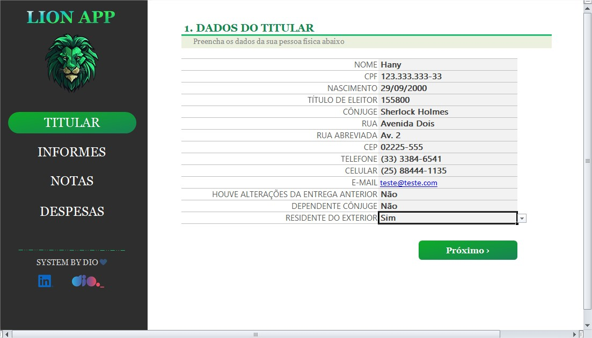
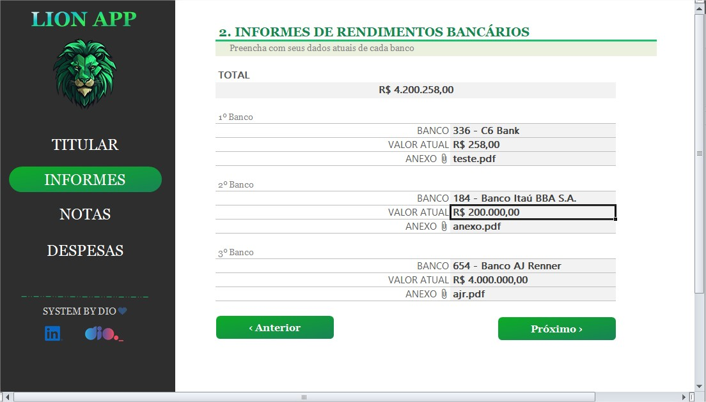
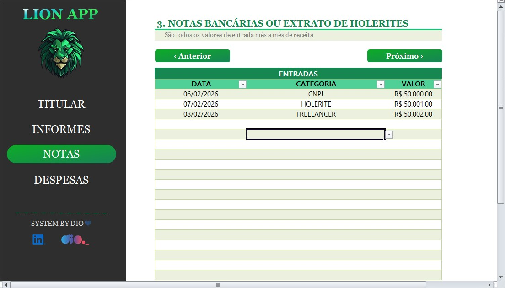
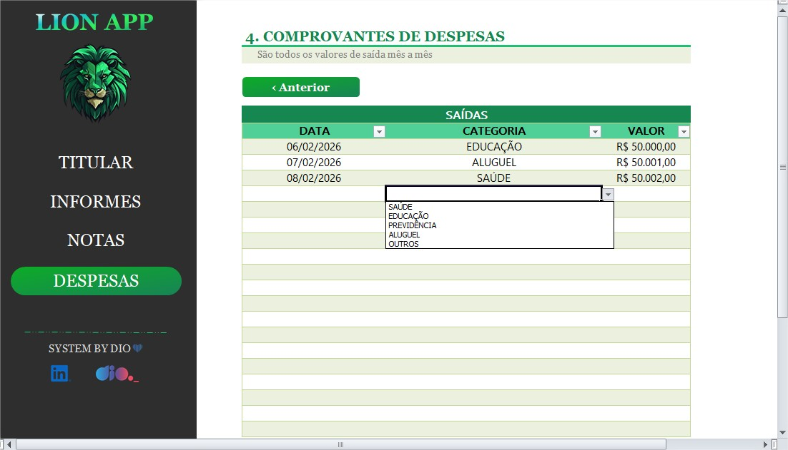
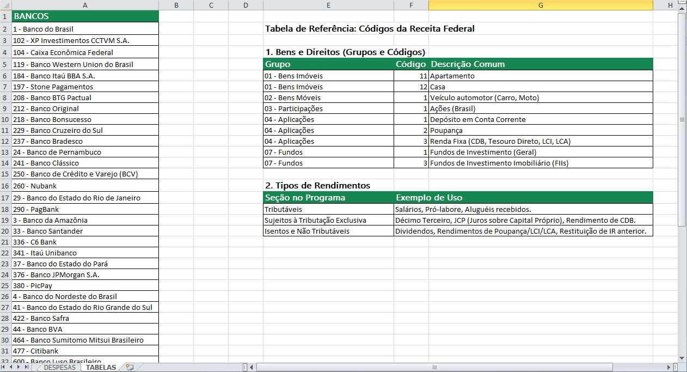

# 📑 Organizador de Imposto de Renda - DIO

Este guia orienta como estruturar uma planilha para organizar e centralizar informações e documentos necessários para a declaração de Imposto de Renda.

## 📂 Estrutura das Abas (Sheets)

Para o funcionamento correto do controle, a planilha é dividida em 4 áreas principais, sendo organizada para refletir as seções do programa da Receita Federal:

### 1. 👤 Dados do Titular (`TITULAR`)
Centraliza as informações básicas que o programa exige anualmente.
* **Campos:** Nome Completo, CPF, Título de Eleitor, Ocupação Principal, Endereço Atualizado e Dados Bancários para Restituição.

    

  

### 2. 🏦 Informes de Rendimentos (`INFORMES`)
Registro consolidado de todos os informes recebidos.
* **Colunas:** Fonte Pagadora (Nome/CNPJ), Tipo de Rendimento (Tributável/Isento), Valor Bruto, IRRF e Contribuição Previdenciária, Categoria (Renda Fixa, Variável) e Saldo em 31/12.

    

  

### 3. 📝 Notas e Comprovantes (`NOTAS`)
Registro de movimentações de bens (Imóveis, Veículos, Ativos) ocorridas no ano-calendário.
* **Colunas:** Data da Operação, Descrição do Bem, Valor de Aquisição/Venda e Situação em 31/12.

    

  

### 4. 🏥 Despesas Dedutíveis (`DESPESAS`)
Controle de gastos que reduzem a base de cálculo (Saúde e Educação).
* **Colunas:** Data, Beneficiário (Nome/CPF ou CNPJ), Descrição (Ex: Consulta Médica) e Valor Pago.

    

  

## 💡 Dicas de Melhorias (Upgrade da Planilha)

Para transformar a planilha em uma ferramenta de gestão eficiente, considere estas implementações:

* **Checklist de Documentação:** Crie uma coluna de status (Pendente / Recebido / Lançado) para cada informe de rendimento (bancos, corretoras e empresas).
* **Coluna de "Código Receita":** Adicione uma coluna para inserir o código oficial da Receita (ex: 11 para Apartamento, 01 para Ações). Isso agiliza o preenchimento manual no programa. Veja mais detalhes no tópico [Tabela de Referência: Códigos da Receita Federal](#-tabela-de-refer%C3%AAncia-c%C3%B3digos-da-receita-federal).
* **Somatórios por Categoria:** Use a fórmula `=SOMAIFS(Valores; Categorias; "Saúde")` para saber o total de despesas médicas antes mesmo de abrir o programa do IR.
* **Pasta Digital Padronizada:** Nomeie seus arquivos PDF de acordo com a planilha (Ex: `2023_Saude_ClinicaX.pdf`). Ter um link direto na planilha para o arquivo evita perda de tempo procurando em e-mails.
* **Histórico de Bens:** Na aba de Bens, mantenha uma coluna com a "Discriminação" já redigida. Assim, no ano seguinte, você apenas copia e cola o texto, alterando apenas os valores de saldo.
* **Filtros:** Use `Ctrl + Shift + L` na linha de cabeçalho.
* **Alinhamento de imagens:** Para manter o alinhamento das imagens utilizadas no arquivo pode ser utilizado um [Script de alinhamento](https://github.com/Hisly-A/Organizador_de_Imposto_de_Renda_DIO/blob/main/script_de_alinhamentos.txt)
  
> **Nota:** Mantenha a aba de `TABELAS` oculta ou protegida. Ela deve conter as alíquotas de impostos e códigos da Receita Federal para alimentar as listas suspensas (Dropdowns) das outras abas.

  

## 📑 Tabela de Referência: Códigos da Receita Federal

Para facilitar o preenchimento na aba **Bens e Direitos**, utilize esta tabela auxiliar em sua aba de `TABELAS`:

#### 1. Bens e Direitos (Grupos e Códigos)

| Grupo | Código | Descrição Comum |
| :--- | :--- | :--- |
| **01 - Bens Imóveis** | 11 | Apartamento |
| **01 - Bens Imóveis** | 12 | Casa |
| **02 - Bens Móveis** | 01 | Veículo automotor (Carro, Moto) |
| **03 - Participações** | 01 | Ações (Brasil) |
| **04 - Aplicações** | 01 | Depósito em Conta Corrente |
| **04 - Aplicações** | 02 | Poupança |
| **04 - Aplicações** | 03 | Renda Fixa (CDB, Tesouro Direto, LCI, LCA) |
| **07 - Fundos** | 01 | Fundos de Investimento (Geral) |
| **07 - Fundos** | 03 | Fundos de Investimento Imobiliário (FIIs) |

#### 2. Tipos de Rendimentos

| Seção no Programa | Exemplo de Uso |
| :--- | :--- |
| **Tributáveis** | Salários, Pró-labore, Aluguéis recebidos. |
| **Sujeitos à Tributação Exclusiva** | Décimo Terceiro, JCP (Juros sobre Capital Próprio), Rendimento de CDB. |
| **Isentos e Não Tributáveis** | Dividendos, Rendimentos de Poupança/LCI/LCA, Restituição de IR anterior. |

  

### 🛠️ Como implementar as Dicas de Melhoria

Para automatizar a sua planilha usando os dados acima, siga estas etapas:

1. **Aba `TABELAS`**: Cole as tabelas acima nesta aba.
2. **Validação de Dados**: Na aba principal (onde você lança seus bens), selecione a célula de "Código" e vá em `Dados > Validação de Dados`. Escolha "Lista" e selecione os códigos da aba `TABELAS`.
3. **Automatize a Descrição**: Use a fórmula `=PROCV` para que, ao digitar o código (ex: 11), a planilha preencha automaticamente o grupo (ex: Bens Imóveis).
   * **Exemplo de fórmula:** `=PROCV(A2; 'TABELAS'!A:C; 2; 0)`
  

    

  

O que essa adição resolve para você:

- Padronização: Você não precisará mais abrir o programa do IR ou o Google para saber qual código usar; estará tudo centralizado.

- Agilidade: Na hora de preencher a declaração oficial, você apenas segue a sequência que já montou na planilha.
  

> **Atenção:** Guarde todos os comprovantes físicos ou digitais por, no mínimo, 5 anos após a entrega da declaração.
